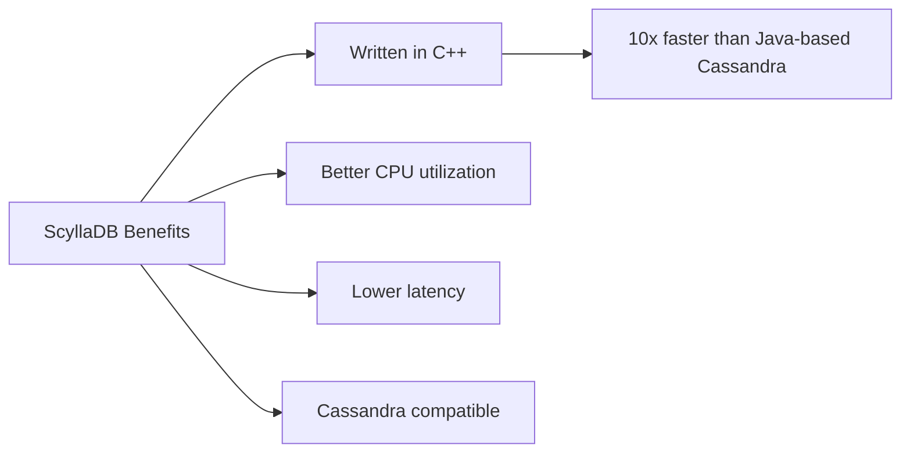
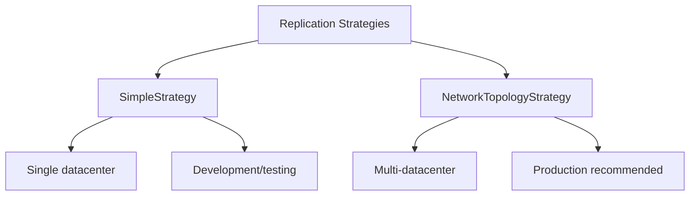
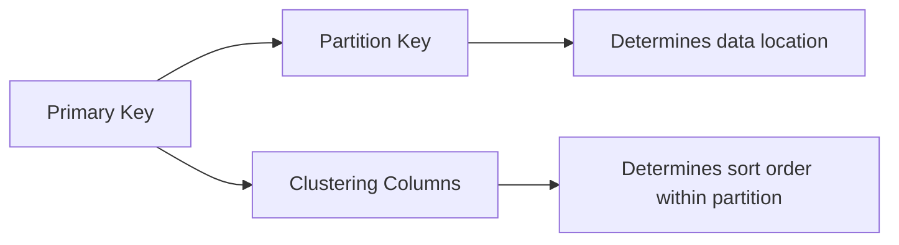
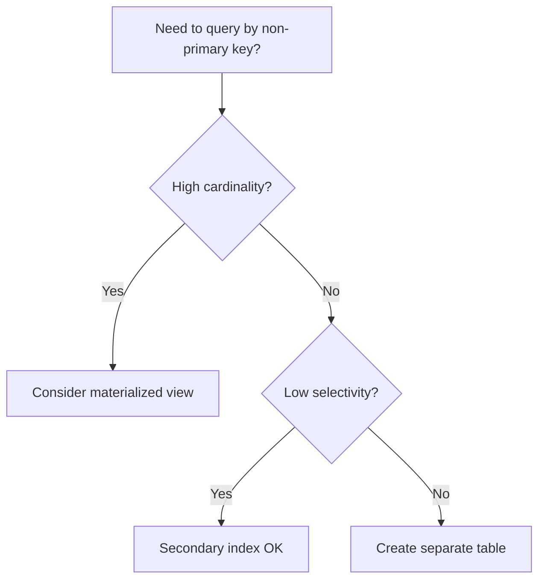

# ScyllaDB and CQL Fundamentals

## Learning Objectives

By the end of this tutorial, you will be able to:
- Understand what ScyllaDB is and why it's used
- Write CQL queries for CRUD operations
- Design effective data models using partition and clustering keys
- Use collections and TTL features
- Apply best practices for ScyllaDB data modeling

---

## What is ScyllaDB?

ScyllaDB is a high-performance NoSQL database that is compatible with Apache Cassandra. It's designed for low-latency and high-throughput workloads.

### Why ScyllaDB over Cassandra?



| Feature | Cassandra | ScyllaDB |
|---------|-----------|----------|
| Language | Java | C++ |
| Latency | Higher (JVM GC pauses) | Lower (no GC) |
| CPU Usage | One thread per core | Shard-per-core architecture |
| Compatibility | Original | 100% CQL compatible |

### When to Use ScyllaDB

- High-throughput applications (millions of ops/sec)
- Low-latency requirements (sub-millisecond)
- Time-series data
- IoT data collection
- User activity tracking
- Session management

---

## CQL vs SQL Differences

CQL (Cassandra Query Language) looks like SQL but has fundamental differences:

### Key Differences

| Aspect | SQL (PostgreSQL) | CQL (ScyllaDB) |
|--------|------------------|----------------|
| Joins | Supported | Not supported |
| Transactions | ACID | Eventually consistent |
| Schema | Normalized | Denormalized |
| Queries | Flexible | Query-driven design |
| NULL handling | Supported | NULLs are not stored |

### Mindset Shift

```sql
-- SQL: Design tables, then write queries
-- CQL: Design queries first, then create tables to support them
```

---

## Keyspaces

A keyspace is similar to a database in SQL. It defines replication settings.

### Creating a Keyspace

```sql
-- Create a keyspace with replication
CREATE KEYSPACE IF NOT EXISTS csa_app
WITH replication = {
    'class': 'NetworkTopologyStrategy',
    'datacenter1': 3
};

-- Use the keyspace
USE csa_app;

-- View all keyspaces
DESCRIBE KEYSPACES;

-- View keyspace details
DESCRIBE KEYSPACE csa_app;
```

### Replication Strategies



```sql
-- SimpleStrategy (development only)
CREATE KEYSPACE dev_keyspace
WITH replication = {
    'class': 'SimpleStrategy',
    'replication_factor': 1
};

-- NetworkTopologyStrategy (production)
CREATE KEYSPACE prod_keyspace
WITH replication = {
    'class': 'NetworkTopologyStrategy',
    'us-east': 3,
    'us-west': 3
};
```

---

## Tables and Primary Keys

### Creating Tables

```sql
-- Basic table creation
CREATE TABLE users (
    user_id UUID,
    email TEXT,
    name TEXT,
    created_at TIMESTAMP,
    PRIMARY KEY (user_id)
);

-- Table with composite primary key
CREATE TABLE user_activities (
    user_id UUID,
    activity_date DATE,
    activity_time TIMESTAMP,
    activity_type TEXT,
    details TEXT,
    PRIMARY KEY ((user_id), activity_date, activity_time)
) WITH CLUSTERING ORDER BY (activity_date DESC, activity_time DESC);
```

### Primary Key Components



---

## Partition Keys vs Clustering Keys

Understanding the difference is crucial for ScyllaDB performance.

### Partition Key

- Determines which node stores the data
- Data with the same partition key is stored together
- Should distribute data evenly

### Clustering Key

- Determines sort order within a partition
- Allows range queries within a partition

### Examples

```sql
-- Single partition key
PRIMARY KEY (user_id)

-- Composite partition key (both columns determine partition)
PRIMARY KEY ((tenant_id, user_id))

-- Partition key + clustering columns
PRIMARY KEY ((user_id), created_at)

-- Partition key + multiple clustering columns
PRIMARY KEY ((user_id), year, month, day)
```

### Practical Example

```sql
-- Messages table for a chat application
CREATE TABLE messages (
    conversation_id UUID,      -- Partition key
    message_id TIMEUUID,       -- Clustering key
    sender_id UUID,
    content TEXT,
    sent_at TIMESTAMP,
    PRIMARY KEY ((conversation_id), message_id)
) WITH CLUSTERING ORDER BY (message_id DESC);

-- All messages in a conversation are stored together
-- Messages are sorted by message_id (time-based)
```

---

## Data Types

### Common Data Types

```sql
-- Numeric types
TINYINT    -- 1 byte
SMALLINT   -- 2 bytes
INT        -- 4 bytes
BIGINT     -- 8 bytes
FLOAT      -- 4-byte floating point
DOUBLE     -- 8-byte floating point
DECIMAL    -- Variable precision
VARINT     -- Arbitrary precision integer

-- Text types
TEXT       -- UTF-8 string (alias: VARCHAR)
ASCII      -- ASCII string

-- UUID types
UUID       -- Random UUID
TIMEUUID   -- Time-based UUID (sortable)

-- Time types
TIMESTAMP  -- Date and time
DATE       -- Date only
TIME       -- Time only
DURATION   -- Time duration

-- Other types
BOOLEAN    -- true/false
BLOB       -- Binary data
INET       -- IP address
```

### Example Table with Various Types

```sql
CREATE TABLE products (
    product_id UUID PRIMARY KEY,
    name TEXT,
    description TEXT,
    price DECIMAL,
    quantity INT,
    is_available BOOLEAN,
    created_at TIMESTAMP,
    tags SET<TEXT>,
    attributes MAP<TEXT, TEXT>,
    images LIST<TEXT>
);
```

---

## CRUD Operations

### INSERT

```sql
-- Basic insert
INSERT INTO users (user_id, email, name, created_at)
VALUES (uuid(), 'john@example.com', 'John Doe', toTimestamp(now()));

-- Insert with TTL (expires in 1 hour)
INSERT INTO sessions (session_id, user_id, data)
VALUES (uuid(), 123e4567-e89b-12d3-a456-426614174000, 'session data')
USING TTL 3600;

-- Insert if not exists
INSERT INTO users (user_id, email, name)
VALUES (uuid(), 'jane@example.com', 'Jane Doe')
IF NOT EXISTS;
```

### SELECT

```sql
-- Select all columns
SELECT * FROM users WHERE user_id = 123e4567-e89b-12d3-a456-426614174000;

-- Select specific columns
SELECT name, email FROM users WHERE user_id = 123e4567-e89b-12d3-a456-426614174000;

-- Select with clustering key range
SELECT * FROM messages
WHERE conversation_id = 123e4567-e89b-12d3-a456-426614174000
AND message_id > minTimeuuid('2024-01-01 00:00:00');

-- Limit results
SELECT * FROM users LIMIT 10;

-- Order by clustering column
SELECT * FROM messages
WHERE conversation_id = 123e4567-e89b-12d3-a456-426614174000
ORDER BY message_id DESC
LIMIT 50;
```

### UPDATE

```sql
-- Basic update
UPDATE users
SET name = 'John Smith', email = 'johnsmith@example.com'
WHERE user_id = 123e4567-e89b-12d3-a456-426614174000;

-- Update with TTL
UPDATE users USING TTL 86400
SET temp_token = 'abc123'
WHERE user_id = 123e4567-e89b-12d3-a456-426614174000;

-- Conditional update (lightweight transaction)
UPDATE users
SET email = 'newemail@example.com'
WHERE user_id = 123e4567-e89b-12d3-a456-426614174000
IF email = 'oldemail@example.com';
```

### DELETE

```sql
-- Delete entire row
DELETE FROM users
WHERE user_id = 123e4567-e89b-12d3-a456-426614174000;

-- Delete specific columns
DELETE email, name FROM users
WHERE user_id = 123e4567-e89b-12d3-a456-426614174000;

-- Delete with condition
DELETE FROM users
WHERE user_id = 123e4567-e89b-12d3-a456-426614174000
IF EXISTS;
```

---

## Indexes and ALLOW FILTERING

### Secondary Indexes

```sql
-- Create a secondary index
CREATE INDEX ON users (email);

-- Now you can query by email
SELECT * FROM users WHERE email = 'john@example.com';

-- Create index with custom name
CREATE INDEX users_email_idx ON users (email);
```

### When to Use Indexes



### ALLOW FILTERING

```sql
-- This query requires ALLOW FILTERING
-- WARNING: Scans all partitions - very slow!
SELECT * FROM users WHERE name = 'John' ALLOW FILTERING;

-- Better approach: Create an index or new table
CREATE INDEX ON users (name);
SELECT * FROM users WHERE name = 'John';
```

**Important**: Avoid `ALLOW FILTERING` in production - it causes full table scans.

---

## Collections

ScyllaDB supports three collection types: List, Set, and Map.

### SET

Unordered collection of unique values.

```sql
-- Create table with set
CREATE TABLE user_roles (
    user_id UUID PRIMARY KEY,
    roles SET<TEXT>
);

-- Insert with set
INSERT INTO user_roles (user_id, roles)
VALUES (uuid(), {'admin', 'user', 'moderator'});

-- Add to set
UPDATE user_roles
SET roles = roles + {'developer'}
WHERE user_id = 123e4567-e89b-12d3-a456-426614174000;

-- Remove from set
UPDATE user_roles
SET roles = roles - {'moderator'}
WHERE user_id = 123e4567-e89b-12d3-a456-426614174000;
```

### LIST

Ordered collection that allows duplicates.

```sql
-- Create table with list
CREATE TABLE user_history (
    user_id UUID PRIMARY KEY,
    recent_searches LIST<TEXT>
);

-- Insert with list
INSERT INTO user_history (user_id, recent_searches)
VALUES (uuid(), ['shoes', 'shirts', 'pants']);

-- Append to list
UPDATE user_history
SET recent_searches = recent_searches + ['jackets']
WHERE user_id = 123e4567-e89b-12d3-a456-426614174000;

-- Prepend to list
UPDATE user_history
SET recent_searches = ['hats'] + recent_searches
WHERE user_id = 123e4567-e89b-12d3-a456-426614174000;

-- Update by index
UPDATE user_history
SET recent_searches[0] = 'boots'
WHERE user_id = 123e4567-e89b-12d3-a456-426614174000;
```

### MAP

Key-value pairs.

```sql
-- Create table with map
CREATE TABLE user_preferences (
    user_id UUID PRIMARY KEY,
    preferences MAP<TEXT, TEXT>
);

-- Insert with map
INSERT INTO user_preferences (user_id, preferences)
VALUES (uuid(), {'theme': 'dark', 'language': 'en', 'timezone': 'UTC'});

-- Update map entries
UPDATE user_preferences
SET preferences['theme'] = 'light'
WHERE user_id = 123e4567-e89b-12d3-a456-426614174000;

-- Add new map entry
UPDATE user_preferences
SET preferences = preferences + {'notifications': 'enabled'}
WHERE user_id = 123e4567-e89b-12d3-a456-426614174000;

-- Remove map entry
DELETE preferences['timezone'] FROM user_preferences
WHERE user_id = 123e4567-e89b-12d3-a456-426614174000;
```

---

## TTL (Time to Live)

TTL automatically expires data after a specified time.

### Setting TTL on Insert

```sql
-- Data expires in 1 hour (3600 seconds)
INSERT INTO sessions (session_id, user_id, token)
VALUES (uuid(), 123e4567-e89b-12d3-a456-426614174000, 'abc123')
USING TTL 3600;
```

### Setting TTL on Update

```sql
-- Update with TTL
UPDATE sessions USING TTL 7200
SET token = 'newtoken'
WHERE session_id = 123e4567-e89b-12d3-a456-426614174000;
```

### Checking TTL

```sql
-- Check remaining TTL
SELECT TTL(token) FROM sessions
WHERE session_id = 123e4567-e89b-12d3-a456-426614174000;
```

### Default TTL on Table

```sql
-- Create table with default TTL
CREATE TABLE temp_data (
    id UUID PRIMARY KEY,
    data TEXT
) WITH default_time_to_live = 86400;  -- 24 hours
```

---

## Best Practices for Data Modeling

### 1. Query-Driven Design

Design your tables based on the queries you need to run.

```sql
-- Query: Get all orders for a user in the last month
CREATE TABLE orders_by_user (
    user_id UUID,
    order_date DATE,
    order_id UUID,
    total DECIMAL,
    status TEXT,
    PRIMARY KEY ((user_id), order_date, order_id)
) WITH CLUSTERING ORDER BY (order_date DESC, order_id DESC);
```

### 2. Denormalize Data

Unlike SQL, it's okay to duplicate data in ScyllaDB.

```sql
-- Table for finding user by email
CREATE TABLE users_by_email (
    email TEXT PRIMARY KEY,
    user_id UUID,
    name TEXT
);

-- Table for finding user by ID
CREATE TABLE users_by_id (
    user_id UUID PRIMARY KEY,
    email TEXT,
    name TEXT
);
```

### 3. Avoid Hot Partitions

Distribute data evenly across partitions.

```sql
-- BAD: All data goes to one partition
PRIMARY KEY ((country), user_id)  -- Most users in one country

-- GOOD: Add bucket for distribution
PRIMARY KEY ((country, bucket), user_id)  -- bucket = user_id % 100
```

### 4. Keep Partitions Bounded

Don't let partitions grow unbounded.

```sql
-- BAD: Unbounded partition
CREATE TABLE user_events (
    user_id UUID,
    event_id TIMEUUID,
    PRIMARY KEY ((user_id), event_id)
);  -- Partition grows forever

-- GOOD: Time-bounded partitions
CREATE TABLE user_events (
    user_id UUID,
    month TEXT,  -- '2024-01'
    event_id TIMEUUID,
    PRIMARY KEY ((user_id, month), event_id)
);  -- New partition each month
```

### 5. Use Appropriate Data Types

```sql
-- Use TIMEUUID for time-sortable IDs
event_id TIMEUUID

-- Use DECIMAL for money
price DECIMAL

-- Use frozen collections in primary keys
PRIMARY KEY ((user_id, frozen<list<text>>))
```

---

## Exercises

### Exercise 1: Design a Blog System

Create tables to support these queries:
1. Get all posts by a user
2. Get all posts in a category
3. Get comments for a post

```sql
-- Your solution here
CREATE TABLE posts_by_user (
    -- Define columns and primary key
);

CREATE TABLE posts_by_category (
    -- Define columns and primary key
);

CREATE TABLE comments_by_post (
    -- Define columns and primary key
);
```

### Exercise 2: Session Management

Create a sessions table with:
- Session ID
- User ID
- Created timestamp
- Last accessed timestamp
- Session data (key-value pairs)
- Auto-expire after 24 hours

```sql
-- Your solution here
```

### Exercise 3: Analytics Events

Design a table for storing user analytics events that:
- Supports querying events for a user in a time range
- Prevents unbounded partition growth
- Stores event properties as a map

```sql
-- Your solution here
```

### Exercise 4: CRUD Operations

Given this table:
```sql
CREATE TABLE products (
    category TEXT,
    product_id UUID,
    name TEXT,
    price DECIMAL,
    tags SET<TEXT>,
    PRIMARY KEY ((category), product_id)
);
```

Write CQL statements to:
1. Insert a product with tags
2. Add a new tag to an existing product
3. Update the price
4. Delete a product
5. Find all products in a category

---

## Summary

Key takeaways:
- ScyllaDB is Cassandra-compatible but faster (C++ vs Java)
- Design tables based on queries, not relationships
- Understand partition keys (data location) vs clustering keys (sort order)
- Use denormalization instead of joins
- Avoid `ALLOW FILTERING` and hot partitions
- Use TTL for automatic data expiration
- Collections (set, list, map) are useful but have limitations

---

## Additional Resources

- [ScyllaDB Documentation](https://docs.scylladb.com/)
- [ScyllaDB University](https://university.scylladb.com/)
- [CQL Reference](https://docs.scylladb.com/stable/cql/)
