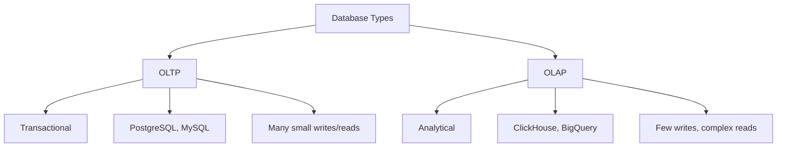
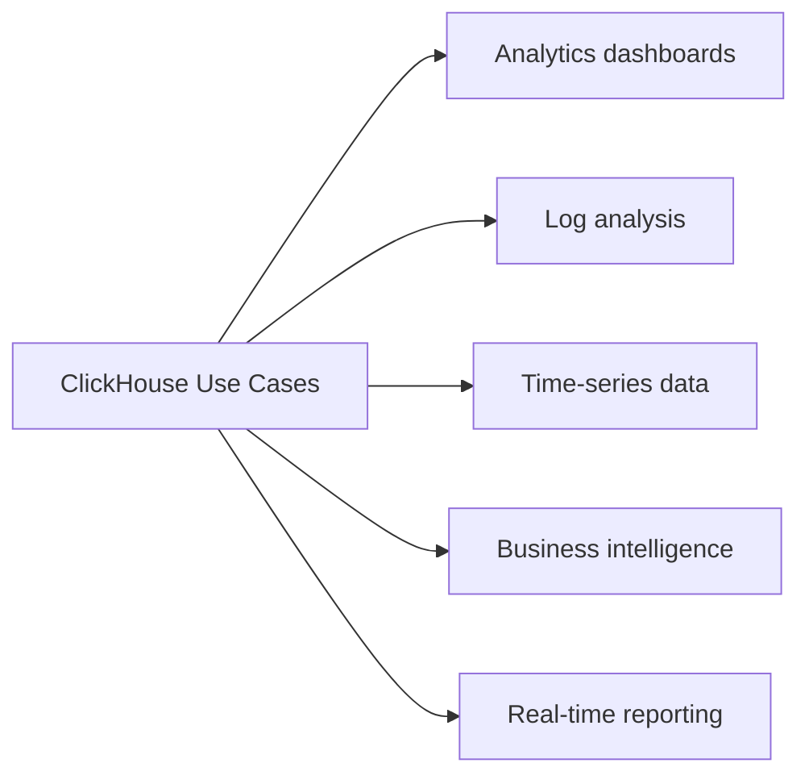

# ClickHouse Basics

## Learning Objectives

By the end of this tutorial, you will be able to:
- Understand what ClickHouse is and when to use it
- Create tables with appropriate engines
- Write queries for analytics workloads
- Perform aggregations and time-series analysis
- Apply ClickHouse best practices

---

## What is ClickHouse?

ClickHouse is an open-source columnar database management system designed for Online Analytical Processing (OLAP).

### OLAP vs OLTP



| Characteristic | OLTP | OLAP (ClickHouse) |
|---------------|------|-------------------|
| Purpose | Transactions | Analytics |
| Operations | INSERT, UPDATE, DELETE | SELECT, aggregations |
| Query pattern | Simple, row-based | Complex, column-based |
| Data volume | Moderate | Very large (TB/PB) |
| Response time | Milliseconds | Seconds (for complex queries) |

### Why ClickHouse?

- **Columnar storage**: Only reads needed columns
- **Compression**: 10-20x compression ratios
- **Vectorized execution**: Processes data in batches
- **Real-time inserts**: Handles millions of rows/second
- **SQL support**: Standard SQL with extensions

---

## Use Cases

### Ideal for ClickHouse



- Web and app analytics
- Monitoring and observability
- IoT data processing
- Ad tech and marketing analytics
- Financial data analysis
- Log aggregation and analysis

### Not Ideal for ClickHouse

- Frequent updates/deletes
- Small transactional queries
- Key-value lookups
- ACID transactions

---

## Table Engines

Table engines determine how data is stored, queried, and managed.

### MergeTree Family

The most commonly used engine family for production.

```sql
-- Basic MergeTree
CREATE TABLE events (
    event_date Date,
    event_time DateTime,
    user_id UInt64,
    event_type String,
    properties String
) ENGINE = MergeTree()
PARTITION BY toYYYYMM(event_date)
ORDER BY (event_date, user_id, event_time);
```

### Engine Types

```sql
-- MergeTree: Basic engine, no deduplication
ENGINE = MergeTree()

-- ReplacingMergeTree: Removes duplicates by sorting key
ENGINE = ReplacingMergeTree(version_column)

-- SummingMergeTree: Sums numeric columns
ENGINE = SummingMergeTree(columns_to_sum)

-- AggregatingMergeTree: Stores aggregation states
ENGINE = AggregatingMergeTree()

-- CollapsingMergeTree: Handles row updates via collapsing
ENGINE = CollapsingMergeTree(sign_column)
```

### Key Concepts

```sql
CREATE TABLE metrics (
    date Date,
    hour UInt8,
    metric_name String,
    value Float64
) ENGINE = MergeTree()
PARTITION BY date                    -- Data partitioning
ORDER BY (date, hour, metric_name)   -- Primary key / sort order
TTL date + INTERVAL 90 DAY;          -- Auto-delete old data
```

- **PARTITION BY**: Groups data for efficient pruning
- **ORDER BY**: Determines sort order and primary index
- **TTL**: Automatic data lifecycle management

---

## Data Types

### Numeric Types

```sql
-- Integers
UInt8, UInt16, UInt32, UInt64, UInt128, UInt256  -- Unsigned
Int8, Int16, Int32, Int64, Int128, Int256        -- Signed

-- Floating point
Float32   -- Single precision
Float64   -- Double precision

-- Decimal (exact precision)
Decimal32(scale)
Decimal64(scale)
Decimal128(scale)
```

### String Types

```sql
String              -- Variable length
FixedString(N)      -- Fixed length
UUID                -- UUID format
```

### Date and Time

```sql
Date        -- YYYY-MM-DD
Date32      -- Extended range
DateTime    -- YYYY-MM-DD HH:MM:SS
DateTime64  -- With subsecond precision
```

### Complex Types

```sql
Array(T)              -- Array of type T
Tuple(T1, T2, ...)    -- Tuple of different types
Map(K, V)             -- Key-value map
Nullable(T)           -- Nullable type
LowCardinality(T)     -- Dictionary encoding for low cardinality
```

### Example Table

```sql
CREATE TABLE user_events (
    event_id UUID,
    timestamp DateTime64(3),
    user_id UInt64,
    event_type LowCardinality(String),
    properties Map(String, String),
    tags Array(String),
    amount Nullable(Decimal64(2))
) ENGINE = MergeTree()
PARTITION BY toYYYYMM(timestamp)
ORDER BY (timestamp, user_id);
```

---

## Basic Queries

### Inserting Data

```sql
-- Insert single row
INSERT INTO events VALUES
    (today(), now(), 12345, 'click', '{"page": "home"}');

-- Insert multiple rows
INSERT INTO events VALUES
    (today(), now(), 12345, 'click', '{}'),
    (today(), now(), 12346, 'view', '{}'),
    (today(), now(), 12347, 'purchase', '{}');

-- Insert from SELECT
INSERT INTO events_backup
SELECT * FROM events WHERE event_date = today();
```

### Selecting Data

```sql
-- Basic select
SELECT * FROM events LIMIT 10;

-- Select with conditions
SELECT user_id, event_type, count() as cnt
FROM events
WHERE event_date >= '2024-01-01'
  AND event_type IN ('click', 'view')
GROUP BY user_id, event_type
ORDER BY cnt DESC
LIMIT 100;

-- Using functions
SELECT
    toStartOfHour(event_time) as hour,
    count() as events
FROM events
WHERE event_date = today()
GROUP BY hour
ORDER BY hour;
```

### Filtering and Conditions

```sql
-- String matching
SELECT * FROM events WHERE event_type LIKE 'click%';
SELECT * FROM events WHERE event_type ILIKE '%CLICK%';  -- Case insensitive

-- Array contains
SELECT * FROM events WHERE has(tags, 'important');

-- NULL handling
SELECT * FROM events WHERE amount IS NOT NULL;

-- IN clause
SELECT * FROM events WHERE user_id IN (1, 2, 3, 4, 5);

-- Date functions
SELECT * FROM events
WHERE event_date BETWEEN today() - 7 AND today();
```

---

## Aggregations

### Basic Aggregations

```sql
-- Count, sum, average
SELECT
    count() as total_events,
    uniq(user_id) as unique_users,
    sum(amount) as total_amount,
    avg(amount) as avg_amount,
    min(timestamp) as first_event,
    max(timestamp) as last_event
FROM events
WHERE event_date = today();
```

### Group By

```sql
-- Simple grouping
SELECT
    event_type,
    count() as cnt,
    uniq(user_id) as users
FROM events
GROUP BY event_type
ORDER BY cnt DESC;

-- Multiple grouping
SELECT
    toDate(timestamp) as date,
    event_type,
    count() as cnt
FROM events
GROUP BY date, event_type
ORDER BY date, cnt DESC;

-- With HAVING
SELECT
    user_id,
    count() as events
FROM events
GROUP BY user_id
HAVING events > 100
ORDER BY events DESC;
```

### Advanced Aggregations

```sql
-- Quantiles
SELECT
    quantile(0.5)(response_time) as median,
    quantile(0.95)(response_time) as p95,
    quantile(0.99)(response_time) as p99
FROM requests;

-- Array aggregation
SELECT
    user_id,
    groupArray(event_type) as all_events
FROM events
GROUP BY user_id;

-- Top K
SELECT topK(10)(event_type) FROM events;

-- Approximate distinct count
SELECT uniqHLL12(user_id) as approx_users FROM events;
```

### Window Functions

```sql
-- Running total
SELECT
    date,
    revenue,
    sum(revenue) OVER (ORDER BY date) as running_total
FROM daily_revenue;

-- Rank
SELECT
    user_id,
    total_purchases,
    rank() OVER (ORDER BY total_purchases DESC) as rank
FROM user_stats;
```

---

## Time-Series Patterns

### Time Bucketing

```sql
-- Events per hour
SELECT
    toStartOfHour(timestamp) as hour,
    count() as events
FROM events
WHERE timestamp >= now() - INTERVAL 24 HOUR
GROUP BY hour
ORDER BY hour;

-- Events per minute
SELECT
    toStartOfMinute(timestamp) as minute,
    count() as events
FROM events
WHERE timestamp >= now() - INTERVAL 1 HOUR
GROUP BY minute
ORDER BY minute;

-- Events per day
SELECT
    toDate(timestamp) as date,
    count() as events
FROM events
WHERE timestamp >= today() - 30
GROUP BY date
ORDER BY date;
```

### Time-Series Table Design

```sql
CREATE TABLE metrics (
    timestamp DateTime,
    metric_name LowCardinality(String),
    tags Map(String, String),
    value Float64
) ENGINE = MergeTree()
PARTITION BY toYYYYMM(timestamp)
ORDER BY (metric_name, timestamp)
TTL timestamp + INTERVAL 90 DAY;
```

### Filling Gaps

```sql
-- Fill missing time buckets with zeros
WITH toStartOfHour(now() - INTERVAL 24 HOUR) as start_time
SELECT
    arrayJoin(
        arrayMap(x -> start_time + x * 3600, range(24))
    ) as hour,
    0 as events
FROM numbers(1)
WHERE hour NOT IN (
    SELECT toStartOfHour(timestamp)
    FROM events
    WHERE timestamp >= start_time
);
```

### Comparing Periods

```sql
-- Compare this week vs last week
SELECT
    toDayOfWeek(timestamp) as day_of_week,
    countIf(timestamp >= today() - 7) as this_week,
    countIf(timestamp < today() - 7 AND timestamp >= today() - 14) as last_week
FROM events
WHERE timestamp >= today() - 14
GROUP BY day_of_week
ORDER BY day_of_week;
```

---

## Practical Examples

### Analytics Dashboard

```sql
-- Daily active users
SELECT
    toDate(timestamp) as date,
    uniq(user_id) as dau
FROM events
WHERE timestamp >= today() - 30
GROUP BY date
ORDER BY date;

-- User retention (Day 1)
SELECT
    toDate(first_seen) as cohort_date,
    count() as total_users,
    countIf(returned_day_1 = 1) as retained,
    retained / total_users as retention_rate
FROM user_cohorts
GROUP BY cohort_date
ORDER BY cohort_date;

-- Funnel analysis
SELECT
    countIf(event_type = 'page_view') as views,
    countIf(event_type = 'add_to_cart') as adds,
    countIf(event_type = 'purchase') as purchases,
    adds / views as view_to_cart,
    purchases / adds as cart_to_purchase
FROM events
WHERE event_date = today();
```

### Log Analysis

```sql
-- Error rate by endpoint
SELECT
    endpoint,
    count() as total,
    countIf(status_code >= 500) as errors,
    errors / total as error_rate
FROM access_logs
WHERE timestamp >= now() - INTERVAL 1 HOUR
GROUP BY endpoint
ORDER BY error_rate DESC
LIMIT 10;

-- Slow queries
SELECT
    query,
    count() as executions,
    avg(duration_ms) as avg_duration,
    quantile(0.99)(duration_ms) as p99
FROM query_logs
WHERE timestamp >= today()
GROUP BY query
HAVING avg_duration > 100
ORDER BY avg_duration DESC;
```

---

## Exercises

### Exercise 1: Create an Events Table

Create a table for web analytics events with:
- Timestamp, user ID, session ID
- Event type, page URL
- Partitioned by month, ordered by timestamp and user

```sql
-- Your solution here
```

### Exercise 2: Daily Metrics Query

Write a query to find:
- Total events per day
- Unique users per day
- Average events per user

```sql
-- Your solution here
```

### Exercise 3: Top Pages

Find the top 10 most viewed pages in the last 7 days with:
- Page URL
- Total views
- Unique viewers
- Average time on page

```sql
-- Your solution here
```

### Exercise 4: Hourly Traffic Pattern

Show traffic pattern by hour of day for the last 30 days:
- Hour (0-23)
- Average events
- Peak day

```sql
-- Your solution here
```

---

## Summary

Key takeaways:
- ClickHouse is optimized for OLAP workloads
- Use MergeTree engine family for production
- Partition by time, order by query patterns
- Leverage columnar storage with selective queries
- Use appropriate data types (LowCardinality, Array, Map)
- Time-series analysis is a core strength

---

## Additional Resources

- [ClickHouse Documentation](https://clickhouse.com/docs)
- [ClickHouse SQL Reference](https://clickhouse.com/docs/en/sql-reference)
- [ClickHouse Playground](https://play.clickhouse.com/)
