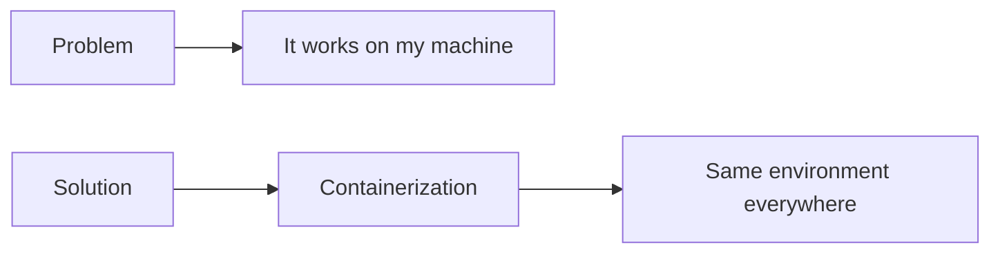
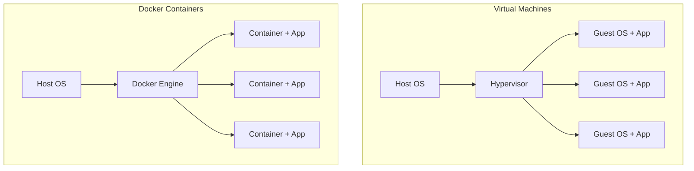
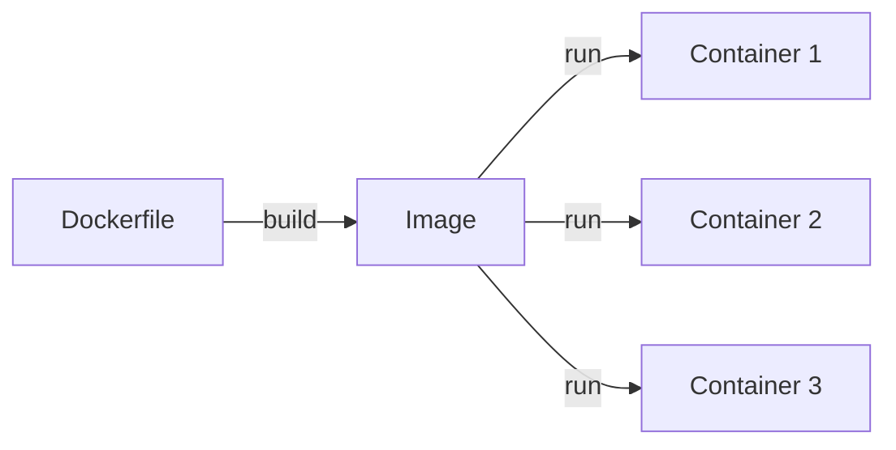
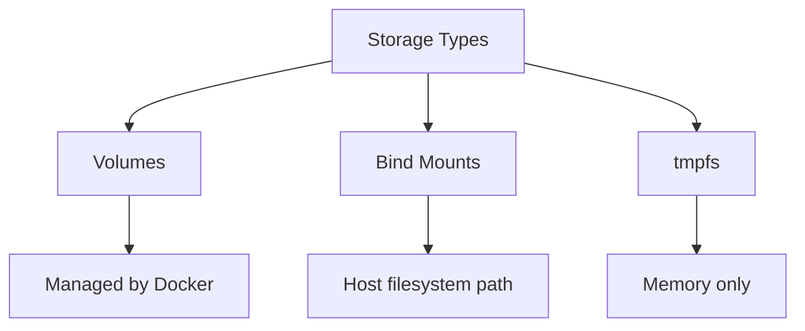
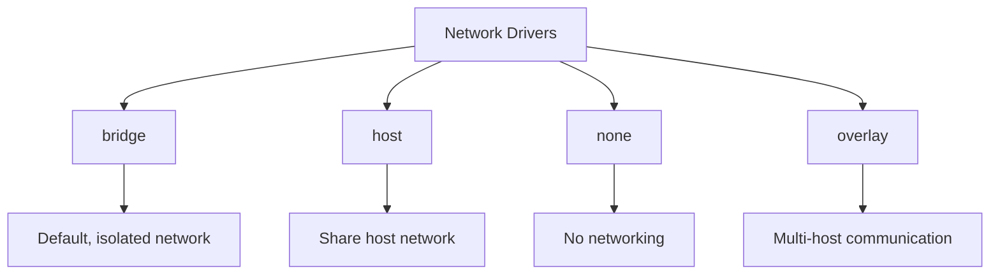

# Docker Basics

## Learning Objectives

By the end of this tutorial, you will be able to:
- Understand what Docker is and why it's used
- Work with Docker images and containers
- Write Dockerfiles for applications
- Use Docker Compose for multi-container applications
- Apply Docker best practices

---

## What is Docker?

Docker is a platform for developing, shipping, and running applications in containers.

### Why Docker?



### Benefits

- **Consistency**: Same environment from development to production
- **Isolation**: Applications run in isolated containers
- **Portability**: Run anywhere Docker is installed
- **Efficiency**: Lightweight compared to VMs
- **Scalability**: Easy to scale horizontally

### Docker vs Virtual Machines



| Aspect | Virtual Machine | Container |
|--------|----------------|-----------|
| Size | GBs | MBs |
| Startup | Minutes | Seconds |
| OS | Full OS per VM | Shared host kernel |
| Isolation | Strong | Process-level |
| Resource usage | High | Low |

---

## Images vs Containers

### Images

- Read-only template for creating containers
- Built from a Dockerfile
- Stored in registries (Docker Hub, ECR, etc.)
- Layered file system

### Containers

- Running instance of an image
- Isolated process
- Has its own filesystem, network, process space
- Ephemeral (can be stopped and removed)



---

## Basic Docker Commands

### Working with Images

```bash
# Pull an image from Docker Hub
docker pull python:3.11-slim

# List local images
docker images

# Remove an image
docker rmi python:3.11-slim

# Remove unused images
docker image prune

# Search for images
docker search nginx
```

### Working with Containers

```bash
# Run a container
docker run nginx

# Run in detached mode (background)
docker run -d nginx

# Run with a name
docker run -d --name my-nginx nginx

# Run with port mapping
docker run -d -p 8080:80 nginx

# Run with environment variables
docker run -d -e MY_VAR=value nginx

# Run interactively
docker run -it python:3.11-slim bash

# List running containers
docker ps

# List all containers (including stopped)
docker ps -a

# Stop a container
docker stop my-nginx

# Start a stopped container
docker start my-nginx

# Remove a container
docker rm my-nginx

# Remove all stopped containers
docker container prune

# View container logs
docker logs my-nginx

# Follow logs in real-time
docker logs -f my-nginx

# Execute command in running container
docker exec -it my-nginx bash

# View container resource usage
docker stats
```

---

## Dockerfile Basics

A Dockerfile is a text file with instructions to build an image.

### Basic Dockerfile

```dockerfile
# Base image
FROM python:3.11-slim

# Set working directory
WORKDIR /app

# Copy requirements file
COPY requirements.txt .

# Install dependencies
RUN pip install --no-cache-dir -r requirements.txt

# Copy application code
COPY . .

# Expose port
EXPOSE 8000

# Command to run
CMD ["python", "app.py"]
```

### Dockerfile Instructions

```dockerfile
# FROM - Base image
FROM ubuntu:22.04

# LABEL - Metadata
LABEL maintainer="dev@example.com"
LABEL version="1.0"

# ENV - Environment variables
ENV APP_HOME=/app
ENV DEBUG=false

# WORKDIR - Set working directory
WORKDIR $APP_HOME

# COPY - Copy files from host to image
COPY src/ ./src/
COPY config.json .

# ADD - Copy with extra features (extract archives, URLs)
ADD archive.tar.gz /app/

# RUN - Execute commands during build
RUN apt-get update && apt-get install -y curl

# ARG - Build-time variables
ARG VERSION=1.0
RUN echo "Building version $VERSION"

# EXPOSE - Document exposed ports
EXPOSE 80 443

# VOLUME - Define mount points
VOLUME /data

# USER - Set user for subsequent commands
USER appuser

# ENTRYPOINT - Configure container as executable
ENTRYPOINT ["python"]

# CMD - Default arguments for ENTRYPOINT
CMD ["app.py"]
```

### Multi-stage Builds

Reduce image size by using multiple stages.

```dockerfile
# Build stage
FROM golang:1.21 AS builder
WORKDIR /app
COPY . .
RUN go build -o myapp

# Runtime stage
FROM alpine:3.18
WORKDIR /app
COPY --from=builder /app/myapp .
CMD ["./myapp"]
```

---

## Building Images

### Build Commands

```bash
# Build from Dockerfile in current directory
docker build -t myapp:latest .

# Build with specific Dockerfile
docker build -f Dockerfile.prod -t myapp:prod .

# Build with build arguments
docker build --build-arg VERSION=2.0 -t myapp:2.0 .

# Build without cache
docker build --no-cache -t myapp:latest .

# Build and tag for registry
docker build -t registry.example.com/myapp:latest .
```

### Example: Python Application

```dockerfile
# Dockerfile
FROM python:3.11-slim

# Set environment variables
ENV PYTHONDONTWRITEBYTECODE=1
ENV PYTHONUNBUFFERED=1

# Create app user
RUN groupadd -r app && useradd -r -g app app

# Set work directory
WORKDIR /app

# Install dependencies
COPY requirements.txt .
RUN pip install --no-cache-dir -r requirements.txt

# Copy application
COPY --chown=app:app . .

# Switch to non-root user
USER app

# Run application
EXPOSE 8000
CMD ["gunicorn", "--bind", "0.0.0.0:8000", "app:app"]
```

```bash
# Build the image
docker build -t python-app:latest .

# Run the container
docker run -d -p 8000:8000 python-app:latest
```

---

## Running Containers

### Common Run Options

```bash
# Basic run
docker run nginx

# Detached mode
docker run -d nginx

# Interactive mode
docker run -it ubuntu bash

# Port mapping
docker run -p 8080:80 nginx              # host:container
docker run -p 127.0.0.1:8080:80 nginx    # specific host IP
docker run -P nginx                       # map all exposed ports

# Environment variables
docker run -e DB_HOST=localhost -e DB_PORT=5432 myapp
docker run --env-file .env myapp

# Named container
docker run --name my-app myapp

# Auto-remove on exit
docker run --rm myapp

# Resource limits
docker run --memory=512m --cpus=1.5 myapp

# Restart policy
docker run --restart=always myapp
docker run --restart=on-failure:5 myapp

# Mount volume
docker run -v /host/path:/container/path myapp
docker run -v myvolume:/data myapp
```

---

## Volumes for Persistence

Volumes persist data outside the container lifecycle.

### Types of Mounts



### Working with Volumes

```bash
# Create a volume
docker volume create mydata

# List volumes
docker volume ls

# Inspect a volume
docker volume inspect mydata

# Remove a volume
docker volume rm mydata

# Remove unused volumes
docker volume prune
```

### Using Volumes

```bash
# Named volume (recommended)
docker run -v mydata:/app/data myapp

# Bind mount (host path)
docker run -v /host/data:/app/data myapp

# Read-only mount
docker run -v mydata:/app/data:ro myapp

# Anonymous volume
docker run -v /app/data myapp
```

### Example: Database with Persistence

```bash
# Create volume for PostgreSQL data
docker volume create pgdata

# Run PostgreSQL with persistent data
docker run -d \
  --name postgres \
  -e POSTGRES_PASSWORD=secret \
  -v pgdata:/var/lib/postgresql/data \
  -p 5432:5432 \
  postgres:15

# Data persists even if container is removed
docker stop postgres
docker rm postgres

# New container uses same data
docker run -d \
  --name postgres \
  -e POSTGRES_PASSWORD=secret \
  -v pgdata:/var/lib/postgresql/data \
  -p 5432:5432 \
  postgres:15
```

---

## Networks

Docker networks enable container communication.

### Network Types



### Working with Networks

```bash
# List networks
docker network ls

# Create a network
docker network create mynetwork

# Run container on network
docker run -d --network mynetwork --name app1 myapp
docker run -d --network mynetwork --name app2 myapp

# Containers can communicate by name
# From app1: curl http://app2:8080

# Connect running container to network
docker network connect mynetwork container1

# Disconnect from network
docker network disconnect mynetwork container1

# Inspect network
docker network inspect mynetwork

# Remove network
docker network rm mynetwork
```

### Example: App with Database

```bash
# Create network
docker network create app-network

# Run database
docker run -d \
  --network app-network \
  --name db \
  -e POSTGRES_PASSWORD=secret \
  postgres:15

# Run application (can connect to 'db' by name)
docker run -d \
  --network app-network \
  --name app \
  -e DATABASE_URL=postgresql://postgres:secret@db:5432/postgres \
  -p 8000:8000 \
  myapp
```

---

## Docker Compose

Docker Compose manages multi-container applications.

### Basic docker-compose.yml

```yaml
version: '3.8'

services:
  web:
    build: .
    ports:
      - "8000:8000"
    environment:
      - DATABASE_URL=postgresql://postgres:secret@db:5432/postgres
    depends_on:
      - db

  db:
    image: postgres:15
    environment:
      - POSTGRES_PASSWORD=secret
    volumes:
      - pgdata:/var/lib/postgresql/data

volumes:
  pgdata:
```

### Compose Commands

```bash
# Start services
docker-compose up

# Start in detached mode
docker-compose up -d

# Build and start
docker-compose up --build

# Stop services
docker-compose down

# Stop and remove volumes
docker-compose down -v

# View logs
docker-compose logs

# Follow logs
docker-compose logs -f

# Scale service
docker-compose up -d --scale web=3

# List running services
docker-compose ps

# Execute command in service
docker-compose exec web bash
```

### Complete Example

```yaml
version: '3.8'

services:
  # Web application
  web:
    build:
      context: .
      dockerfile: Dockerfile
    ports:
      - "8000:8000"
    environment:
      - DATABASE_URL=postgresql://postgres:secret@db:5432/appdb
      - REDIS_URL=redis://redis:6379
      - DEBUG=false
    depends_on:
      db:
        condition: service_healthy
      redis:
        condition: service_started
    volumes:
      - ./src:/app/src
    restart: unless-stopped

  # Database
  db:
    image: postgres:15
    environment:
      - POSTGRES_USER=postgres
      - POSTGRES_PASSWORD=secret
      - POSTGRES_DB=appdb
    volumes:
      - pgdata:/var/lib/postgresql/data
      - ./init.sql:/docker-entrypoint-initdb.d/init.sql
    ports:
      - "5432:5432"
    healthcheck:
      test: ["CMD-SHELL", "pg_isready -U postgres"]
      interval: 10s
      timeout: 5s
      retries: 5

  # Cache
  redis:
    image: redis:7-alpine
    ports:
      - "6379:6379"
    volumes:
      - redisdata:/data

  # Nginx reverse proxy
  nginx:
    image: nginx:alpine
    ports:
      - "80:80"
    volumes:
      - ./nginx.conf:/etc/nginx/nginx.conf:ro
    depends_on:
      - web

volumes:
  pgdata:
  redisdata:

networks:
  default:
    name: app-network
```

---

## Common Commands Reference

### Image Commands

```bash
docker build -t name:tag .      # Build image
docker images                   # List images
docker pull image:tag           # Pull image
docker push image:tag           # Push image
docker rmi image:tag            # Remove image
docker image prune              # Remove unused images
```

### Container Commands

```bash
docker run [options] image      # Create and start container
docker start container          # Start stopped container
docker stop container           # Stop container
docker restart container        # Restart container
docker rm container             # Remove container
docker ps                       # List running containers
docker ps -a                    # List all containers
docker logs container           # View logs
docker exec -it container cmd   # Execute command
docker inspect container        # View details
```

### Volume Commands

```bash
docker volume create name       # Create volume
docker volume ls                # List volumes
docker volume rm name           # Remove volume
docker volume prune             # Remove unused volumes
```

### Network Commands

```bash
docker network create name      # Create network
docker network ls               # List networks
docker network rm name          # Remove network
docker network connect net con  # Connect container
```

### Compose Commands

```bash
docker-compose up -d            # Start services
docker-compose down             # Stop services
docker-compose logs             # View logs
docker-compose ps               # List services
docker-compose build            # Build services
```

---

## Exercises

### Exercise 1: Basic Container

Run an Nginx container on port 8080 and verify it's working.

```bash
# Your commands here
```

### Exercise 2: Build Custom Image

Create a Dockerfile for a simple Python Flask app:

```python
# app.py
from flask import Flask
app = Flask(__name__)

@app.route('/')
def hello():
    return "Hello, Docker!"

if __name__ == '__main__':
    app.run(host='0.0.0.0', port=5000)
```

```dockerfile
# Dockerfile
# Your Dockerfile here
```

### Exercise 3: Multi-Container Setup

Create a docker-compose.yml for:
- Python web app
- PostgreSQL database
- Redis cache

```yaml
# docker-compose.yml
# Your configuration here
```

### Exercise 4: Persistent Data

Set up a MySQL database with:
- Persistent volume for data
- Custom network
- Health check

```bash
# Your commands or docker-compose.yml here
```

### Exercise 5: Multi-stage Build

Create a multi-stage Dockerfile for a Go application that:
- Builds in a golang image
- Runs in a minimal alpine image

```dockerfile
# Dockerfile
# Your multi-stage build here
```

---

## Summary

Key takeaways:
- Docker containers provide consistent, isolated environments
- Images are templates, containers are running instances
- Dockerfiles define how to build images
- Volumes persist data beyond container lifecycle
- Networks enable container communication
- Docker Compose manages multi-container applications
- Use multi-stage builds to reduce image size

---

## Additional Resources

- [Docker Documentation](https://docs.docker.com/)
- [Dockerfile Best Practices](https://docs.docker.com/develop/develop-images/dockerfile_best-practices/)
- [Docker Compose Documentation](https://docs.docker.com/compose/)
- [Docker Hub](https://hub.docker.com/)
