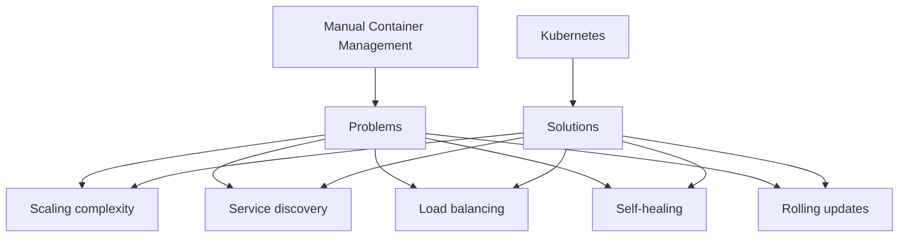
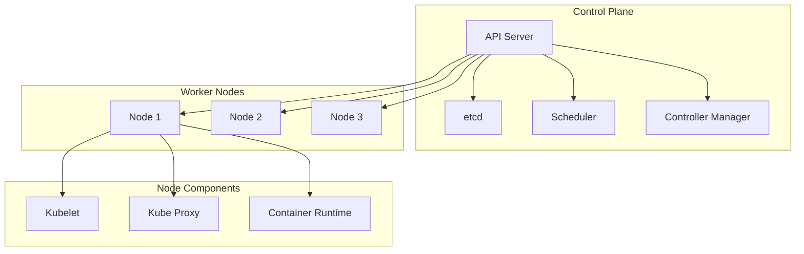
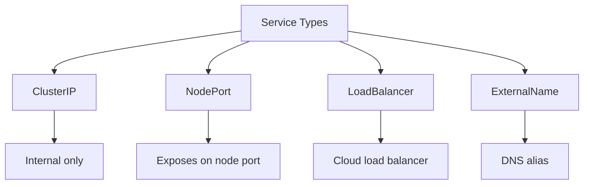
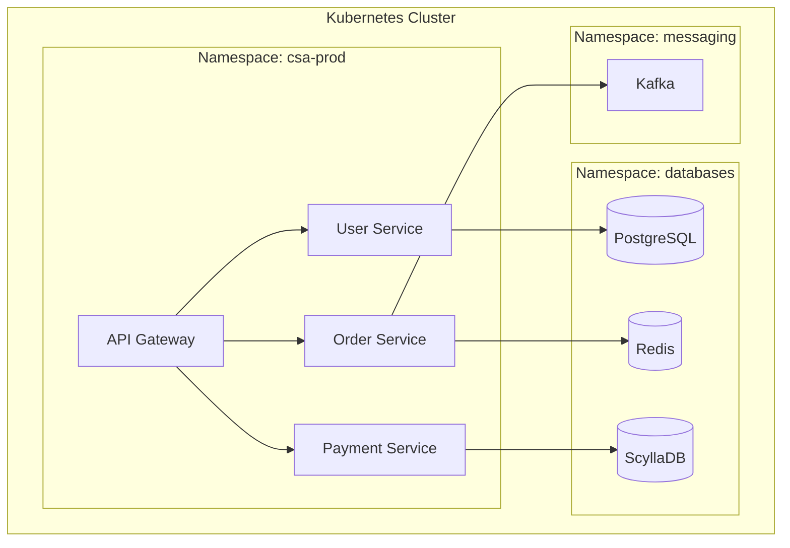

# Kubernetes Basics

## Learning Objectives

By the end of this tutorial, you will be able to:
- Understand Kubernetes architecture and concepts
- Work with Pods, Deployments, and Services
- Configure applications with ConfigMaps and Secrets
- Use kubectl to manage Kubernetes resources
- Write YAML manifests for Kubernetes objects

---

## What is Kubernetes?

Kubernetes (K8s) is an open-source container orchestration platform that automates deployment, scaling, and management of containerized applications.

### Why Kubernetes?



### Key Features

- **Automatic scaling**: Scale applications based on demand
- **Self-healing**: Restart failed containers, replace nodes
- **Service discovery**: Built-in DNS and load balancing
- **Automated rollouts**: Zero-downtime deployments
- **Secret management**: Secure storage for sensitive data
- **Storage orchestration**: Automatic mounting of storage systems

### Architecture



---

## Pods

A Pod is the smallest deployable unit in Kubernetes, representing one or more containers.

### Pod Characteristics

- One or more containers
- Shared network namespace (localhost)
- Shared storage volumes
- Ephemeral by default

### Basic Pod YAML

```yaml
apiVersion: v1
kind: Pod
metadata:
  name: my-pod
  labels:
    app: myapp
spec:
  containers:
    - name: main
      image: nginx:latest
      ports:
        - containerPort: 80
```

### Pod with Multiple Containers

```yaml
apiVersion: v1
kind: Pod
metadata:
  name: multi-container-pod
spec:
  containers:
    - name: app
      image: myapp:latest
      ports:
        - containerPort: 8000

    - name: sidecar
      image: fluentd:latest
      volumeMounts:
        - name: logs
          mountPath: /var/log/app

  volumes:
    - name: logs
      emptyDir: {}
```

### Pod Commands

```bash
# Create pod from YAML
kubectl apply -f pod.yaml

# List pods
kubectl get pods

# Get pod details
kubectl describe pod my-pod

# View pod logs
kubectl logs my-pod

# Execute command in pod
kubectl exec -it my-pod -- bash

# Delete pod
kubectl delete pod my-pod

# Port forward
kubectl port-forward my-pod 8080:80
```

---

## Deployments

Deployments manage ReplicaSets and provide declarative updates for Pods.

### Why Deployments?

- Manage multiple replicas
- Rolling updates
- Rollback capability
- Self-healing

### Basic Deployment

```yaml
apiVersion: apps/v1
kind: Deployment
metadata:
  name: myapp-deployment
spec:
  replicas: 3
  selector:
    matchLabels:
      app: myapp
  template:
    metadata:
      labels:
        app: myapp
    spec:
      containers:
        - name: myapp
          image: myapp:1.0
          ports:
            - containerPort: 8000
          resources:
            requests:
              memory: "128Mi"
              cpu: "100m"
            limits:
              memory: "256Mi"
              cpu: "500m"
```

### Deployment with Health Checks

```yaml
apiVersion: apps/v1
kind: Deployment
metadata:
  name: myapp-deployment
spec:
  replicas: 3
  selector:
    matchLabels:
      app: myapp
  template:
    metadata:
      labels:
        app: myapp
    spec:
      containers:
        - name: myapp
          image: myapp:1.0
          ports:
            - containerPort: 8000

          # Liveness probe - restart if fails
          livenessProbe:
            httpGet:
              path: /health
              port: 8000
            initialDelaySeconds: 30
            periodSeconds: 10

          # Readiness probe - remove from service if fails
          readinessProbe:
            httpGet:
              path: /ready
              port: 8000
            initialDelaySeconds: 5
            periodSeconds: 5
```

### Deployment Commands

```bash
# Create deployment
kubectl apply -f deployment.yaml

# List deployments
kubectl get deployments

# Get deployment details
kubectl describe deployment myapp-deployment

# Scale deployment
kubectl scale deployment myapp-deployment --replicas=5

# Update image
kubectl set image deployment/myapp-deployment myapp=myapp:2.0

# View rollout status
kubectl rollout status deployment/myapp-deployment

# Rollback deployment
kubectl rollout undo deployment/myapp-deployment

# View rollout history
kubectl rollout history deployment/myapp-deployment
```

### Deployment Strategy

```yaml
apiVersion: apps/v1
kind: Deployment
metadata:
  name: myapp-deployment
spec:
  replicas: 3
  strategy:
    type: RollingUpdate
    rollingUpdate:
      maxSurge: 1        # Max pods over desired
      maxUnavailable: 0  # Max pods unavailable during update
  selector:
    matchLabels:
      app: myapp
  template:
    # ... pod template
```

---

## Services

Services provide stable networking for Pods.

### Service Types



### ClusterIP (Default)

Internal service accessible only within the cluster.

```yaml
apiVersion: v1
kind: Service
metadata:
  name: myapp-service
spec:
  type: ClusterIP
  selector:
    app: myapp
  ports:
    - protocol: TCP
      port: 80        # Service port
      targetPort: 8000  # Container port
```

### NodePort

Exposes service on each node's IP at a static port.

```yaml
apiVersion: v1
kind: Service
metadata:
  name: myapp-nodeport
spec:
  type: NodePort
  selector:
    app: myapp
  ports:
    - protocol: TCP
      port: 80
      targetPort: 8000
      nodePort: 30080  # 30000-32767
```

### LoadBalancer

Exposes service externally using cloud provider's load balancer.

```yaml
apiVersion: v1
kind: Service
metadata:
  name: myapp-lb
spec:
  type: LoadBalancer
  selector:
    app: myapp
  ports:
    - protocol: TCP
      port: 80
      targetPort: 8000
```

### Service Commands

```bash
# Create service
kubectl apply -f service.yaml

# List services
kubectl get services

# Get service details
kubectl describe service myapp-service

# Get endpoints
kubectl get endpoints myapp-service

# Delete service
kubectl delete service myapp-service

# Expose deployment as service
kubectl expose deployment myapp-deployment --port=80 --target-port=8000
```

---

## ConfigMaps and Secrets

### ConfigMaps

Store non-confidential configuration data.

```yaml
apiVersion: v1
kind: ConfigMap
metadata:
  name: app-config
data:
  # Key-value pairs
  DATABASE_HOST: "postgres"
  DATABASE_PORT: "5432"

  # File content
  app.properties: |
    server.port=8000
    logging.level=INFO
```

#### Using ConfigMaps

```yaml
apiVersion: apps/v1
kind: Deployment
metadata:
  name: myapp
spec:
  template:
    spec:
      containers:
        - name: myapp
          image: myapp:1.0

          # As environment variables
          envFrom:
            - configMapRef:
                name: app-config

          # Specific keys
          env:
            - name: DB_HOST
              valueFrom:
                configMapKeyRef:
                  name: app-config
                  key: DATABASE_HOST

          # As mounted files
          volumeMounts:
            - name: config-volume
              mountPath: /etc/config

      volumes:
        - name: config-volume
          configMap:
            name: app-config
```

### Secrets

Store sensitive data (base64 encoded).

```yaml
apiVersion: v1
kind: Secret
metadata:
  name: app-secrets
type: Opaque
data:
  # Base64 encoded values
  username: YWRtaW4=        # admin
  password: cGFzc3dvcmQ=    # password
```

```bash
# Create secret from literal
kubectl create secret generic app-secrets \
  --from-literal=username=admin \
  --from-literal=password=secret

# Create from file
kubectl create secret generic tls-secret \
  --from-file=tls.crt \
  --from-file=tls.key
```

#### Using Secrets

```yaml
apiVersion: apps/v1
kind: Deployment
metadata:
  name: myapp
spec:
  template:
    spec:
      containers:
        - name: myapp
          image: myapp:1.0

          # As environment variables
          env:
            - name: DB_PASSWORD
              valueFrom:
                secretKeyRef:
                  name: app-secrets
                  key: password

          # As mounted files
          volumeMounts:
            - name: secrets-volume
              mountPath: /etc/secrets
              readOnly: true

      volumes:
        - name: secrets-volume
          secret:
            secretName: app-secrets
```

---

## Namespaces

Namespaces provide logical isolation for resources.

### Common Use Cases

- Separate environments (dev, staging, prod)
- Team/project isolation
- Resource quota management

### Namespace Commands

```bash
# List namespaces
kubectl get namespaces

# Create namespace
kubectl create namespace development

# Set default namespace
kubectl config set-context --current --namespace=development

# Get resources in namespace
kubectl get pods -n development

# Get resources in all namespaces
kubectl get pods --all-namespaces
```

### Namespace YAML

```yaml
apiVersion: v1
kind: Namespace
metadata:
  name: development
  labels:
    environment: dev
```

### Resource Quotas

```yaml
apiVersion: v1
kind: ResourceQuota
metadata:
  name: compute-quota
  namespace: development
spec:
  hard:
    requests.cpu: "4"
    requests.memory: 8Gi
    limits.cpu: "8"
    limits.memory: 16Gi
    pods: "20"
```

---

## kubectl Commands

### Basic Commands

```bash
# Cluster info
kubectl cluster-info
kubectl get nodes

# Get resources
kubectl get pods
kubectl get deployments
kubectl get services
kubectl get all

# Describe resources
kubectl describe pod <pod-name>
kubectl describe deployment <deployment-name>

# Create/update resources
kubectl apply -f manifest.yaml
kubectl create -f manifest.yaml

# Delete resources
kubectl delete -f manifest.yaml
kubectl delete pod <pod-name>

# Edit resources
kubectl edit deployment <deployment-name>
```

### Debugging Commands

```bash
# View logs
kubectl logs <pod-name>
kubectl logs <pod-name> -c <container-name>
kubectl logs -f <pod-name>  # Follow
kubectl logs --previous <pod-name>  # Previous instance

# Execute commands
kubectl exec -it <pod-name> -- bash
kubectl exec <pod-name> -- ls /app

# Port forwarding
kubectl port-forward <pod-name> 8080:80
kubectl port-forward svc/<service-name> 8080:80

# Copy files
kubectl cp <pod-name>:/path/file ./local-file
kubectl cp ./local-file <pod-name>:/path/file
```

### Output Formats

```bash
# Wide output
kubectl get pods -o wide

# YAML output
kubectl get pod <pod-name> -o yaml

# JSON output
kubectl get pod <pod-name> -o json

# Custom columns
kubectl get pods -o custom-columns=NAME:.metadata.name,STATUS:.status.phase

# JSONPath
kubectl get pods -o jsonpath='{.items[*].metadata.name}'
```

---

## YAML Manifest Examples

### Complete Application Setup

```yaml
# Namespace
apiVersion: v1
kind: Namespace
metadata:
  name: myapp

---
# ConfigMap
apiVersion: v1
kind: ConfigMap
metadata:
  name: myapp-config
  namespace: myapp
data:
  LOG_LEVEL: "info"
  SERVER_PORT: "8000"

---
# Secret
apiVersion: v1
kind: Secret
metadata:
  name: myapp-secrets
  namespace: myapp
type: Opaque
stringData:
  DATABASE_URL: "postgresql://user:pass@db:5432/mydb"

---
# Deployment
apiVersion: apps/v1
kind: Deployment
metadata:
  name: myapp
  namespace: myapp
spec:
  replicas: 3
  selector:
    matchLabels:
      app: myapp
  template:
    metadata:
      labels:
        app: myapp
    spec:
      containers:
        - name: myapp
          image: myapp:1.0
          ports:
            - containerPort: 8000
          envFrom:
            - configMapRef:
                name: myapp-config
          env:
            - name: DATABASE_URL
              valueFrom:
                secretKeyRef:
                  name: myapp-secrets
                  key: DATABASE_URL
          resources:
            requests:
              memory: "128Mi"
              cpu: "100m"
            limits:
              memory: "256Mi"
              cpu: "500m"
          livenessProbe:
            httpGet:
              path: /health
              port: 8000
            initialDelaySeconds: 30
            periodSeconds: 10
          readinessProbe:
            httpGet:
              path: /ready
              port: 8000
            initialDelaySeconds: 5
            periodSeconds: 5

---
# Service
apiVersion: v1
kind: Service
metadata:
  name: myapp
  namespace: myapp
spec:
  type: ClusterIP
  selector:
    app: myapp
  ports:
    - protocol: TCP
      port: 80
      targetPort: 8000

---
# Ingress (optional)
apiVersion: networking.k8s.io/v1
kind: Ingress
metadata:
  name: myapp-ingress
  namespace: myapp
  annotations:
    nginx.ingress.kubernetes.io/rewrite-target: /
spec:
  rules:
    - host: myapp.example.com
      http:
        paths:
          - path: /
            pathType: Prefix
            backend:
              service:
                name: myapp
                port:
                  number: 80
```

---

## How CSA Uses Kubernetes

### Microservices Deployment



### CSA Service Example

```yaml
apiVersion: apps/v1
kind: Deployment
metadata:
  name: user-service
  namespace: csa-prod
spec:
  replicas: 3
  selector:
    matchLabels:
      app: user-service
  template:
    metadata:
      labels:
        app: user-service
        version: "1.0"
    spec:
      containers:
        - name: user-service
          image: csa/user-service:1.0
          ports:
            - containerPort: 8000
          env:
            - name: DATABASE_URL
              valueFrom:
                secretKeyRef:
                  name: db-credentials
                  key: url
            - name: KAFKA_BROKERS
              value: "kafka.messaging:9092"
          resources:
            requests:
              memory: "256Mi"
              cpu: "200m"
            limits:
              memory: "512Mi"
              cpu: "1000m"
```

---

## Exercises

### Exercise 1: Deploy a Simple App

Create and deploy a simple nginx application with:
- 2 replicas
- ClusterIP service
- Resource limits

```yaml
# Your YAML here
```

### Exercise 2: ConfigMap and Secret

Create:
- ConfigMap with database host and port
- Secret with database password
- Deployment that uses both

```yaml
# Your YAML here
```

### Exercise 3: Rolling Update

1. Deploy version 1.0 of an app
2. Update to version 2.0 with rolling update
3. Rollback to version 1.0

```bash
# Your commands here
```

### Exercise 4: Expose Service Externally

Create a deployment with a LoadBalancer service that exposes the app on port 80.

```yaml
# Your YAML here
```

### Exercise 5: Complete Application

Deploy a web application with:
- Namespace
- ConfigMap for configuration
- Secret for credentials
- Deployment with 3 replicas
- Service (ClusterIP)
- Probes for health checking

```yaml
# Your YAML here
```

---

## Summary

Key takeaways:
- Kubernetes orchestrates containerized applications
- Pods are the smallest deployable unit
- Deployments manage replica sets and updates
- Services provide stable networking
- ConfigMaps and Secrets manage configuration
- Namespaces provide logical isolation
- kubectl is the primary CLI tool
- YAML manifests define desired state

---

## Additional Resources

- [Kubernetes Documentation](https://kubernetes.io/docs/)
- [kubectl Cheat Sheet](https://kubernetes.io/docs/reference/kubectl/cheatsheet/)
- [Kubernetes Patterns](https://k8spatterns.io/)
- [CKAD Curriculum](https://github.com/cncf/curriculum)
