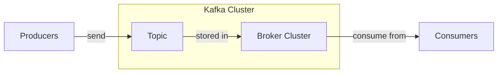
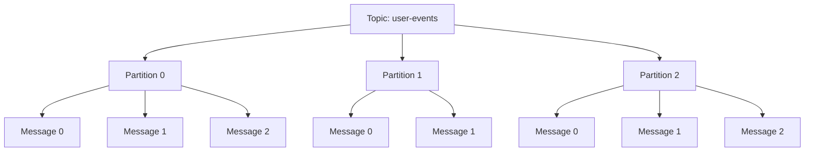
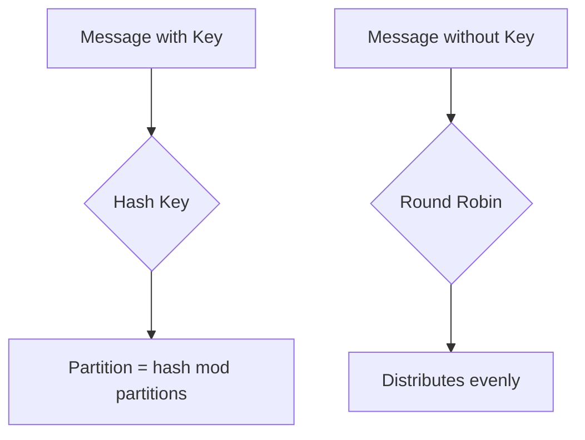
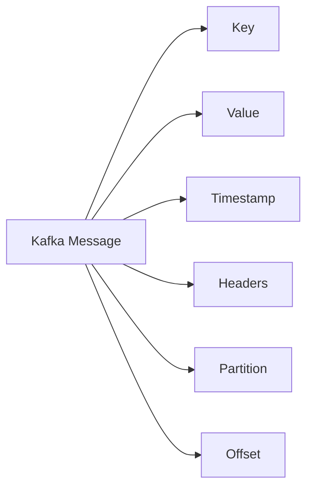
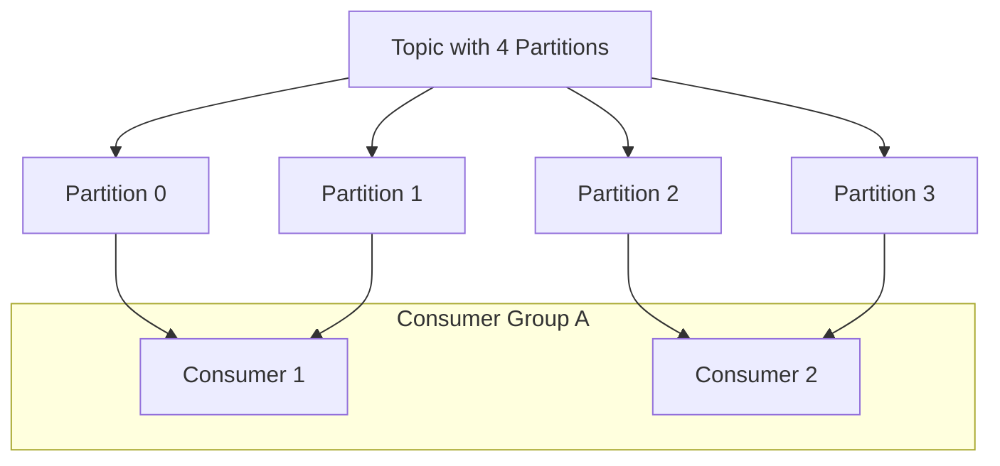
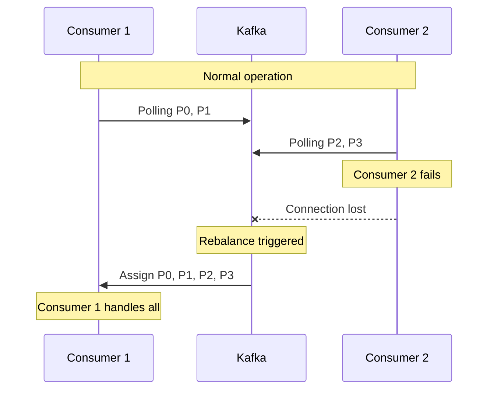
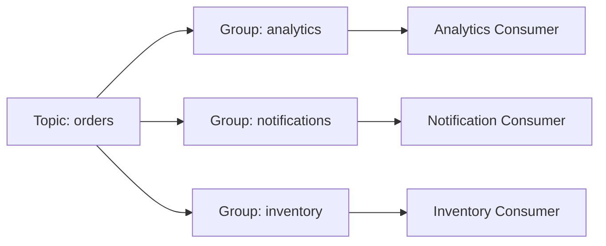
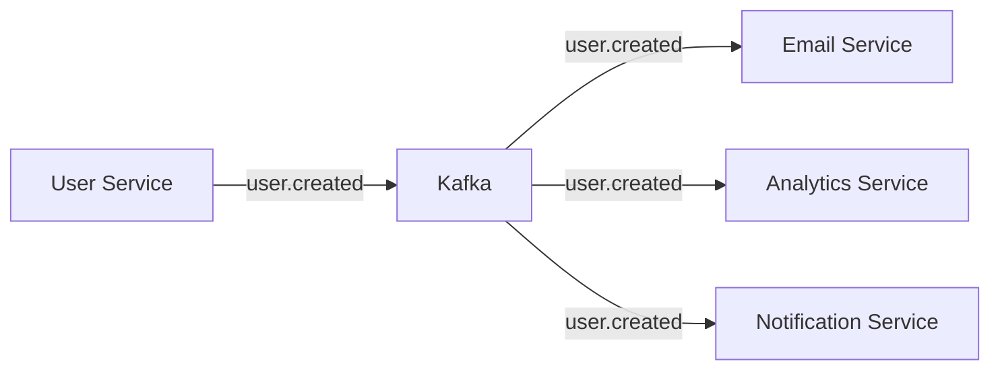
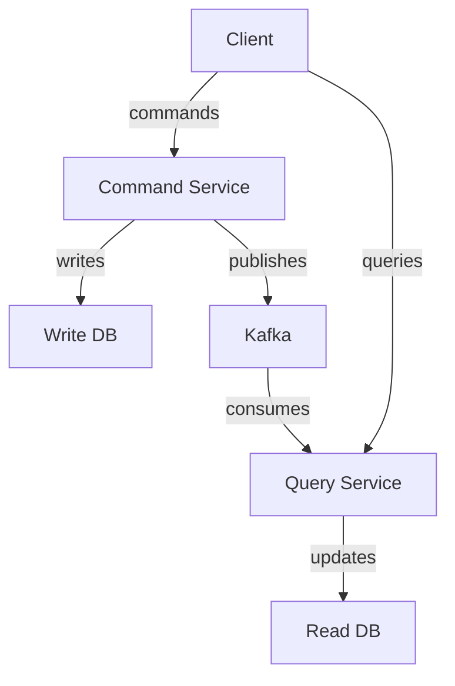
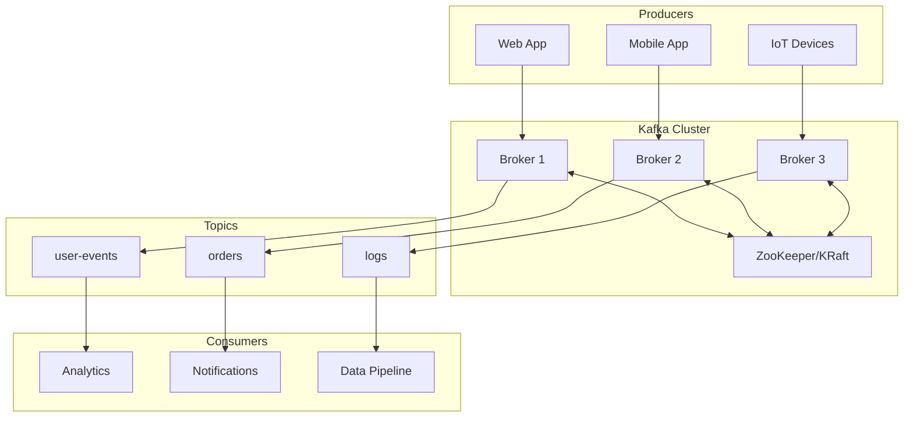

# Apache Kafka Fundamentals

## Learning Objectives

By the end of this tutorial, you will be able to:
- Understand Kafka's architecture and core concepts
- Work with topics, partitions, and consumer groups
- Write producers and consumers
- Understand delivery guarantees
- Apply Kafka patterns in real-world applications

---

## What is Apache Kafka?

Apache Kafka is a distributed event streaming platform capable of handling trillions of events per day.

### Core Concepts



### Key Characteristics

- **Distributed**: Runs on a cluster of machines
- **Durable**: Messages are persisted to disk
- **Scalable**: Handles high throughput
- **Fault-tolerant**: Replicates data across nodes
- **Real-time**: Low latency message delivery

### Use Cases

- Event sourcing
- Log aggregation
- Stream processing
- Metrics collection
- Message queuing
- Activity tracking
- Commit logs

---

## Topics and Partitions

### Topics

A topic is a category or feed name to which messages are published.



### Partitions

- Topics are split into partitions
- Each partition is an ordered, immutable sequence
- Messages are assigned sequential IDs (offsets)
- Partitions enable parallelism

### Creating Topics

```bash
# Create a topic with 3 partitions and replication factor of 3
kafka-topics.sh --create \
  --topic user-events \
  --bootstrap-server localhost:9092 \
  --partitions 3 \
  --replication-factor 3

# List topics
kafka-topics.sh --list --bootstrap-server localhost:9092

# Describe a topic
kafka-topics.sh --describe \
  --topic user-events \
  --bootstrap-server localhost:9092

# Delete a topic
kafka-topics.sh --delete \
  --topic user-events \
  --bootstrap-server localhost:9092
```

### Partition Strategy



---

## Messages and Offsets

### Message Structure



### Message Components

- **Key**: Used for partitioning (optional)
- **Value**: The actual data (payload)
- **Timestamp**: When the message was created
- **Headers**: Metadata key-value pairs
- **Offset**: Position in the partition

### Offsets

```
Partition 0: [0] [1] [2] [3] [4] [5] [6] [7]
                              ^
                        Consumer offset = 5
                        (next message to read)
```

Offsets are:
- Unique within a partition
- Immutable once assigned
- Used to track consumer position
- Enable replay from any point

---

## Producers

Producers send messages to Kafka topics.

### Basic Producer (Python)

```python
from kafka import KafkaProducer
import json

# Create producer
producer = KafkaProducer(
    bootstrap_servers=['localhost:9092'],
    value_serializer=lambda v: json.dumps(v).encode('utf-8'),
    key_serializer=lambda k: k.encode('utf-8') if k else None
)

# Send message without key (round-robin partitioning)
producer.send('user-events', value={'event': 'login', 'user_id': 123})

# Send message with key (key-based partitioning)
producer.send(
    'user-events',
    key='user-123',
    value={'event': 'purchase', 'amount': 99.99}
)

# Send with callback
def on_success(metadata):
    print(f"Sent to {metadata.topic}:{metadata.partition}:{metadata.offset}")

def on_error(error):
    print(f"Error: {error}")

future = producer.send('user-events', value={'event': 'logout'})
future.add_callback(on_success).add_errback(on_error)

# Flush and close
producer.flush()
producer.close()
```

### Producer Configuration

```python
producer = KafkaProducer(
    bootstrap_servers=['localhost:9092'],

    # Serialization
    key_serializer=str.encode,
    value_serializer=lambda v: json.dumps(v).encode('utf-8'),

    # Reliability
    acks='all',              # Wait for all replicas
    retries=3,               # Retry on failure
    retry_backoff_ms=100,

    # Performance
    batch_size=16384,        # Batch messages
    linger_ms=10,            # Wait to batch
    compression_type='gzip', # Compress messages

    # Idempotence
    enable_idempotence=True  # Exactly-once semantics
)
```

### Producer Patterns

```python
# Synchronous send (wait for acknowledgment)
future = producer.send('topic', value=data)
metadata = future.get(timeout=10)  # Blocks until sent

# Asynchronous send with callback
producer.send('topic', value=data).add_callback(on_success)

# Batch send
for event in events:
    producer.send('topic', value=event)
producer.flush()  # Wait for all to complete
```

---

## Consumers

Consumers read messages from Kafka topics.

### Basic Consumer (Python)

```python
from kafka import KafkaConsumer
import json

# Create consumer
consumer = KafkaConsumer(
    'user-events',
    bootstrap_servers=['localhost:9092'],
    group_id='my-consumer-group',
    value_deserializer=lambda m: json.loads(m.decode('utf-8')),
    auto_offset_reset='earliest'  # Start from beginning
)

# Consume messages
for message in consumer:
    print(f"Topic: {message.topic}")
    print(f"Partition: {message.partition}")
    print(f"Offset: {message.offset}")
    print(f"Key: {message.key}")
    print(f"Value: {message.value}")
    print("---")

# Close consumer
consumer.close()
```

### Consumer Configuration

```python
consumer = KafkaConsumer(
    'user-events',
    bootstrap_servers=['localhost:9092'],

    # Consumer group
    group_id='my-group',

    # Deserialization
    key_deserializer=lambda k: k.decode('utf-8') if k else None,
    value_deserializer=lambda v: json.loads(v.decode('utf-8')),

    # Offset management
    auto_offset_reset='earliest',  # or 'latest'
    enable_auto_commit=True,
    auto_commit_interval_ms=5000,

    # Performance
    fetch_min_bytes=1,
    fetch_max_wait_ms=500,
    max_poll_records=500
)
```

### Manual Offset Commit

```python
consumer = KafkaConsumer(
    'user-events',
    group_id='my-group',
    enable_auto_commit=False  # Manual commit
)

for message in consumer:
    try:
        # Process message
        process(message.value)

        # Commit after successful processing
        consumer.commit()
    except Exception as e:
        print(f"Error processing message: {e}")
        # Don't commit - message will be reprocessed
```

### Consuming from Specific Partitions

```python
from kafka import TopicPartition

consumer = KafkaConsumer(bootstrap_servers=['localhost:9092'])

# Assign specific partitions
partitions = [
    TopicPartition('user-events', 0),
    TopicPartition('user-events', 1)
]
consumer.assign(partitions)

# Seek to specific offset
consumer.seek(TopicPartition('user-events', 0), 100)

for message in consumer:
    print(message.value)
```

---

## Consumer Groups

Consumer groups enable parallel processing and fault tolerance.

### How Consumer Groups Work



### Key Points

- Each partition is consumed by exactly one consumer in a group
- If consumers > partitions, some consumers are idle
- If partitions > consumers, some consumers handle multiple partitions
- Consumer failure triggers rebalancing

### Rebalancing



### Multiple Consumer Groups



Each group receives all messages independently.

---

## Delivery Guarantees

### At-Most-Once

Messages may be lost but never redelivered.

```python
# Auto-commit before processing
consumer = KafkaConsumer(
    'topic',
    enable_auto_commit=True,
    auto_commit_interval_ms=1000
)

for message in consumer:
    # If crash here, message is lost
    process(message)
```

### At-Least-Once

Messages are never lost but may be redelivered.

```python
# Commit after processing
consumer = KafkaConsumer(
    'topic',
    enable_auto_commit=False
)

for message in consumer:
    process(message)
    # If crash after process but before commit,
    # message will be reprocessed
    consumer.commit()
```

### Exactly-Once

Messages are delivered exactly once (most complex).

```python
# Producer with idempotence
producer = KafkaProducer(
    enable_idempotence=True,
    acks='all'
)

# Consumer with transactional processing
# Requires additional setup and Kafka Streams/transactions
```

### Choosing a Guarantee

| Guarantee | Use Case | Trade-off |
|-----------|----------|-----------|
| At-most-once | Metrics, logs | May lose data |
| At-least-once | Most applications | May duplicate |
| Exactly-once | Financial transactions | Performance overhead |

---

## Use Cases in CSA

### Event-Driven Architecture



### Microservice Communication

```python
# Order Service - Producer
def create_order(order_data):
    order = save_to_database(order_data)

    # Publish event
    producer.send('order-events',
        key=str(order.id),
        value={
            'event_type': 'order.created',
            'order_id': order.id,
            'user_id': order.user_id,
            'total': order.total,
            'timestamp': datetime.utcnow().isoformat()
        }
    )

    return order

# Inventory Service - Consumer
consumer = KafkaConsumer('order-events', group_id='inventory-service')

for message in consumer:
    event = message.value
    if event['event_type'] == 'order.created':
        reserve_inventory(event['order_id'])
```

### CQRS Pattern



### Log Aggregation

```python
# Application logs to Kafka
import logging
from kafka_handler import KafkaLoggingHandler

handler = KafkaLoggingHandler(
    hosts=['localhost:9092'],
    topic='application-logs'
)

logger = logging.getLogger()
logger.addHandler(handler)

logger.info("Application started", extra={'service': 'user-api'})
```

---

## Architecture Diagram



---

## Code Examples

### Complete Producer Example

```python
from kafka import KafkaProducer
from datetime import datetime
import json
import uuid

class EventProducer:
    def __init__(self, bootstrap_servers):
        self.producer = KafkaProducer(
            bootstrap_servers=bootstrap_servers,
            value_serializer=lambda v: json.dumps(v).encode('utf-8'),
            key_serializer=lambda k: k.encode('utf-8') if k else None,
            acks='all',
            retries=3,
            enable_idempotence=True
        )

    def send_event(self, topic, event_type, data, key=None):
        event = {
            'event_id': str(uuid.uuid4()),
            'event_type': event_type,
            'timestamp': datetime.utcnow().isoformat(),
            'data': data
        }

        future = self.producer.send(topic, key=key, value=event)
        return future

    def close(self):
        self.producer.flush()
        self.producer.close()

# Usage
producer = EventProducer(['localhost:9092'])

# Send user event
producer.send_event(
    topic='user-events',
    event_type='user.registered',
    data={'user_id': 123, 'email': 'user@example.com'},
    key='user-123'
)

producer.close()
```

### Complete Consumer Example

```python
from kafka import KafkaConsumer
import json
import signal
import sys

class EventConsumer:
    def __init__(self, topics, group_id, bootstrap_servers):
        self.consumer = KafkaConsumer(
            *topics,
            bootstrap_servers=bootstrap_servers,
            group_id=group_id,
            value_deserializer=lambda m: json.loads(m.decode('utf-8')),
            auto_offset_reset='earliest',
            enable_auto_commit=False
        )
        self.running = True

        # Handle graceful shutdown
        signal.signal(signal.SIGINT, self.shutdown)
        signal.signal(signal.SIGTERM, self.shutdown)

    def shutdown(self, signum, frame):
        print("Shutting down...")
        self.running = False

    def process_message(self, message):
        """Override this method to process messages"""
        print(f"Received: {message.value}")

    def run(self):
        try:
            while self.running:
                messages = self.consumer.poll(timeout_ms=1000)

                for topic_partition, records in messages.items():
                    for message in records:
                        try:
                            self.process_message(message)
                            self.consumer.commit()
                        except Exception as e:
                            print(f"Error processing message: {e}")
        finally:
            self.consumer.close()

# Usage
class UserEventConsumer(EventConsumer):
    def process_message(self, message):
        event = message.value

        if event['event_type'] == 'user.registered':
            self.handle_registration(event['data'])
        elif event['event_type'] == 'user.login':
            self.handle_login(event['data'])

    def handle_registration(self, data):
        print(f"New user registered: {data['email']}")
        # Send welcome email, etc.

    def handle_login(self, data):
        print(f"User logged in: {data['user_id']}")

consumer = UserEventConsumer(
    topics=['user-events'],
    group_id='user-service',
    bootstrap_servers=['localhost:9092']
)
consumer.run()
```

---

## Exercises

### Exercise 1: Basic Producer and Consumer

Create a producer that sends 100 messages with incrementing counters, and a consumer that reads and prints them.

```python
# Producer
# Your code here

# Consumer
# Your code here
```

### Exercise 2: Keyed Messages

Modify the producer to use user IDs as keys. Verify that messages with the same key go to the same partition.

```python
# Your code here
```

### Exercise 3: Consumer Group

Create two consumers in the same group consuming from a topic with 4 partitions. Observe how partitions are distributed.

```python
# Consumer 1
# Your code here

# Consumer 2
# Your code here
```

### Exercise 4: At-Least-Once Processing

Implement a consumer with manual offset commit that:
1. Processes the message
2. Saves to a database
3. Only commits if both succeed

```python
# Your code here
```

### Exercise 5: Event-Driven Order System

Design and implement:
1. Order service that publishes `order.created` events
2. Inventory service that reserves items
3. Notification service that sends confirmations

```python
# Order Service
# Your code here

# Inventory Service
# Your code here

# Notification Service
# Your code here
```

---

## Summary

Key takeaways:
- Kafka is a distributed event streaming platform
- Topics are split into partitions for parallelism
- Producers send messages, consumers read them
- Consumer groups enable parallel processing
- Choose delivery guarantees based on requirements
- Message ordering is guaranteed within a partition
- Use keys for related message routing

---

## Additional Resources

- [Apache Kafka Documentation](https://kafka.apache.org/documentation/)
- [Kafka Python Client](https://kafka-python.readthedocs.io/)
- [Confluent Kafka Tutorials](https://developer.confluent.io/tutorials/)
- [Kafka: The Definitive Guide](https://www.confluent.io/resources/kafka-the-definitive-guide/)
